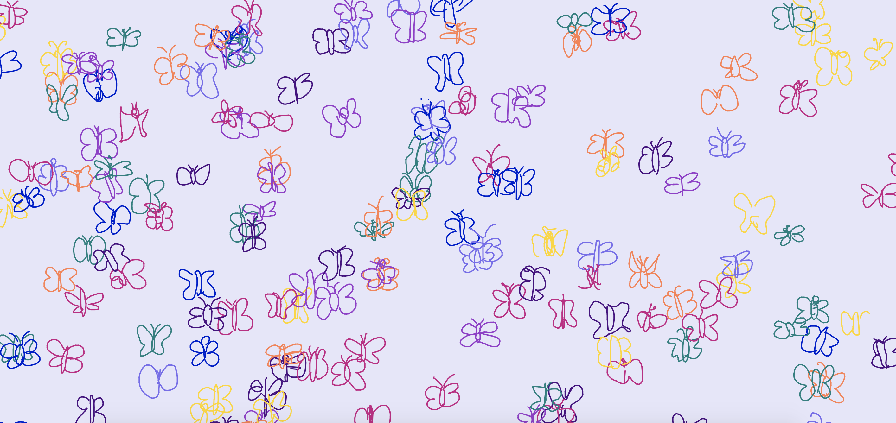

# Butterfly Meadow

This project generates butterflies using the recurrent neural network model Sketch-RNN, which has been ported to TensorFlow.js under the Magenta.js project. <a href="https://magenta.tensorflow.org/"> Magenta</a> is an open source research project exploring the role of machine learning as a tool in creative processes.

 See the sketching action <a href="https://anushadatta.github.io/ButterflyMeadow/">HERE</a>!

Sketch-RNN was taught to draw by training it on millions of doodles collected from the <i> Quick, Draw! </i> game. With over 100 different models to choose from, the butterfly object is just one possible choice. All those doodles contributing to that particular dataset can be found & viewed <a href="https://quickdraw.withgoogle.com/data/butterfly"> here</a>. 

Visualizing neural network generated drawings in the web browser has been made possible by using <a href="https://ml5js.org/"> ml5js</a>, which is a library built on top of TensorFlow.js with no other external dependencies. 

Go ahead & try doodling other objects for yourself with SketchRNN's online <a href="https://magenta.tensorflow.org/assets/sketch_rnn_demo/index.html">demo</a>.  
